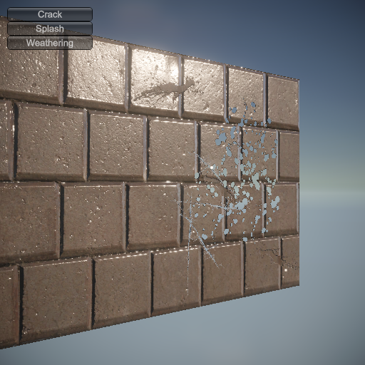
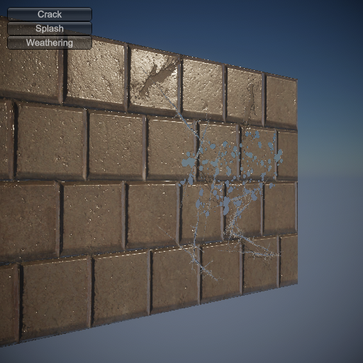

# TangentDecalUnity

A decal system designed for projecting decals in tangent space (UV space) for use with SkinnedMeshRenderers in Unity.

## Features

### Use Cases

- Proper decal application for objects that deform through animation.
- Use for representing transparency effects with decals.

### Advantages

- Suitable for projection onto deforming renderers, such as SkinnedMeshRenderers and ClothRenderers.
- Since the decal effect is applied as a texture, it allows for flexible expressions, such as changing alpha values using Shader Graph.

### Disadvantages

- Each renderer that is a target for decals must be registered individually, and the materials must be independent for each renderer, with correctly set UVs.
- Each decal target is assigned a RenderTexture, and a RenderPass is issued, making the system unsuiable for large-scale applications.

## Requirements

- Unity 6 (URP 17)
- Unity 6 (HDRP 17)